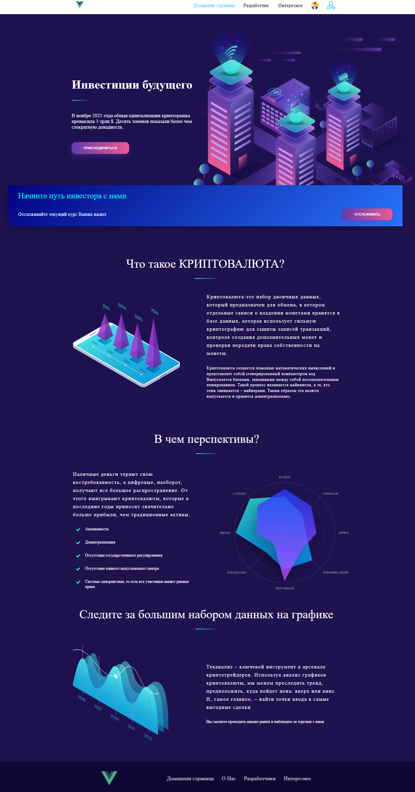
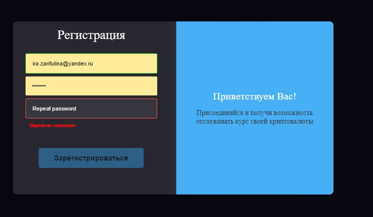
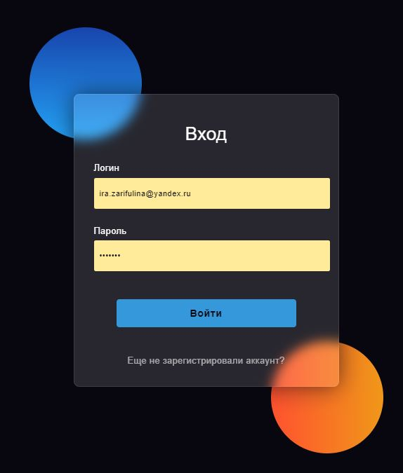
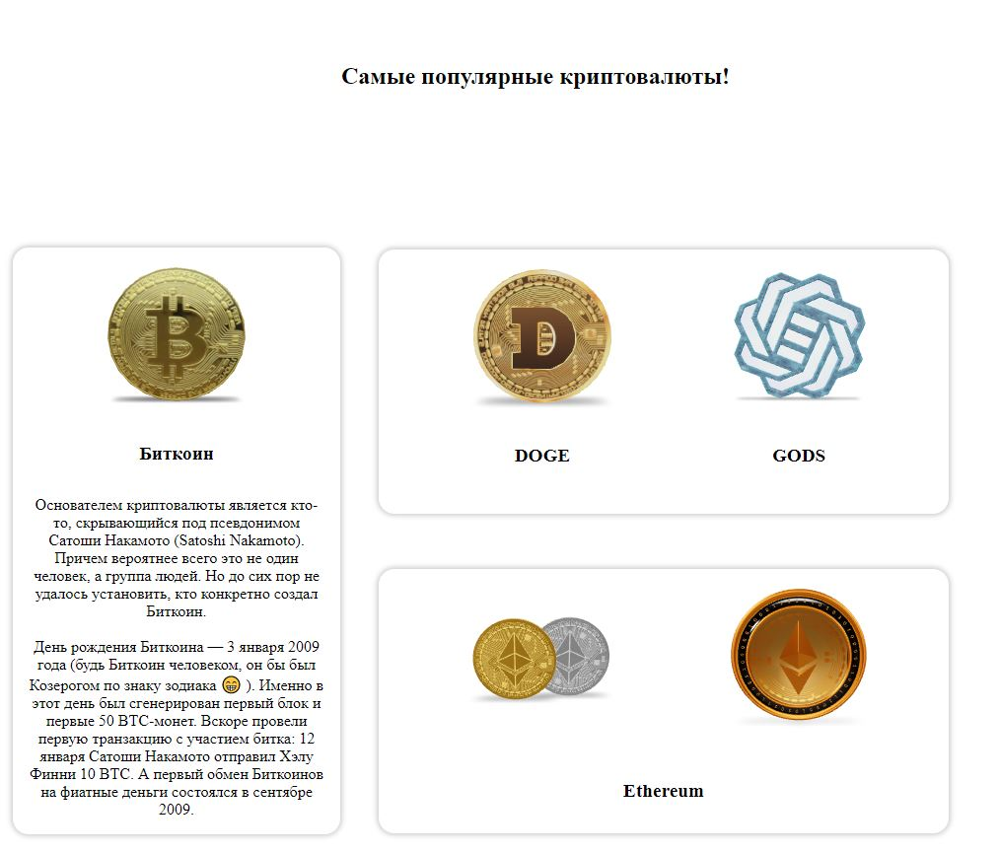
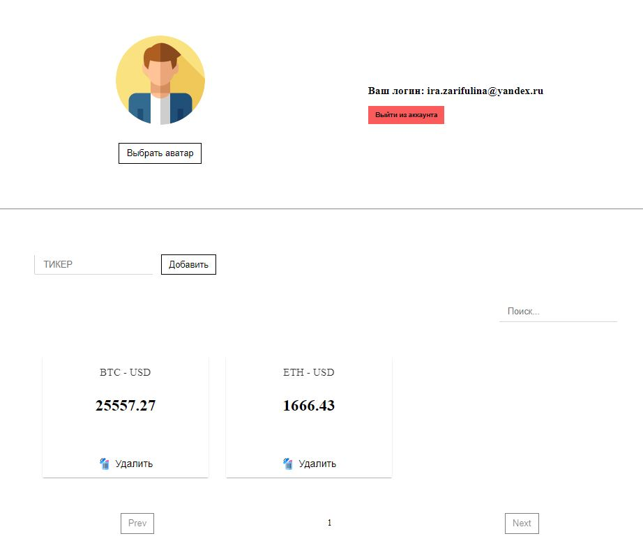
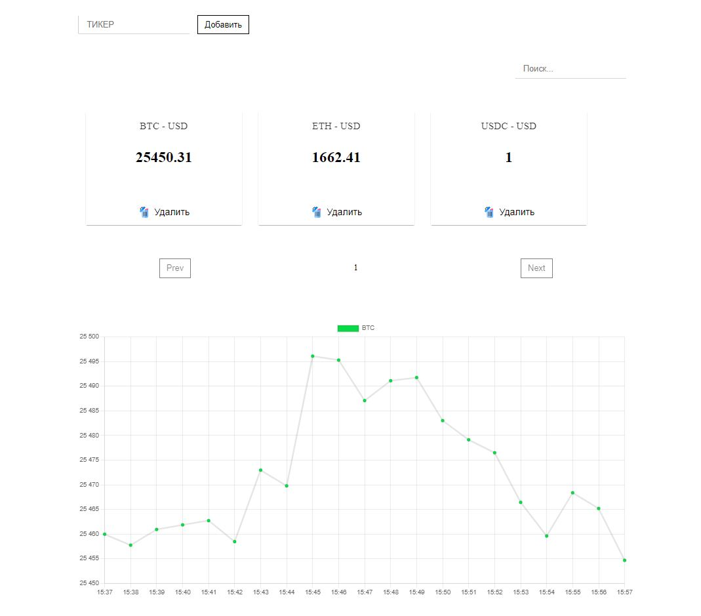

# cryptocompare
учебный проект
Запуск клиента: 
# app

## Project setup
```
npm install
```

### Compiles and hot-reloads for development
```
npm run serve
```

### Compiles and minifies for production
```
npm run build
```

### Lints and fixes files
```
npm run lint
```

### Customize configuration
See [Configuration Reference](https://cli.vuejs.org/config/).

Запуск сервера: 
# server

## Project setup
```
npm install
```

### Compiles and hot-reloads for development
```
npm start
```
Сервер работает на localhost:5000

База данных активна на localhost:5432

Клиентская часть запускается на localhost:8080









